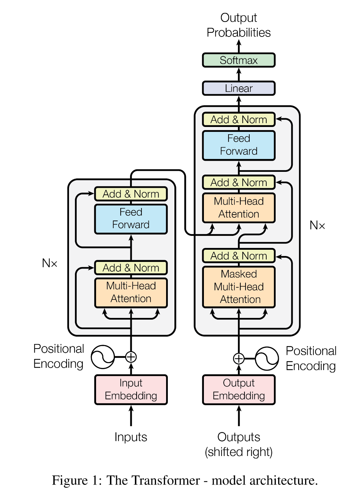

**1. [ChatGPT3.5 和 ChatGPT3.5-Turbo 的区别](https://cloud.tencent.com/developer/article/2232022)**
   ChatGPT3.5 与 ChatGPT3.5-Turbo 的使用方式基本相同，但其功能上有一些可观察到的差异:
   - ChatGPT3.5 主要用于自然语言处理、机器翻译等任务，而 ChatGPT3.5-Turbo 拥有更强大的强度，可用于更复杂的语言分析，比如情感分析、语法结构分析。
   - ChatGPT3.5 支持更多的语言模型，可以更准确地解释自然语言输入；ChatGPT3.5-Turbo 只有一种语言模型，支持基于语料库的解释。
   - ChatGPT3.5 的计算效率比 ChatGPT3.5-Turbo 要低，但其测试数据的准确性要高。

**2. Attention Is All You Need论文解读**

读论文：
1. 标题+作者
2. 摘要
   - BLEU score：机器翻译里经常用到的衡量标准。
   - 一开始是针对机器翻译任务的。
3. 结论
   - 第一个做序列转录（sequence transduction）的模型
   - 仅仅使用注意力
   - 把所有循环换成了multi head self-attention
   - 使得生成不那么持续化也是另外的一个研究方向
4. 导言
   - RNN：一步一步计算，难以并行
   - attention用于RNN
   - 纯基于注意力机制
5. 相关工作
   - 卷积神经网络对于比较长的序列难以建模
   - 卷积可以做多个输出通道，一个输出通道可以识别不一样的模式，multi head self-attention可以模拟这样的效果
   - memory networks：
6. 模型
   - 编码器：将一些原始输入变成一个机器学习可以理解的一系列向量
   - 解码器：一个一个生成，自回归（autogressive）在过去时刻的输出会作为当前的输入。
   - [LayerNorm和BatchNorm的区别](https://zhuanlan.zhihu.com/p/428620330)：BN是针对每个特征，对1个batch内的所有样本做归一化；LN是针对每个样本，对这个样本的所有特征做归一化。BN相当于抹杀了不同特征间的关系而保留了不同样本间的关系，适用于CV领域；LN相当于抹杀了不同样本间的大小关系而保留了不同特征间的大小关系，适用于NLP领域。
   - 加性注意力机制（additive attention） ：可以处理query和key不等长的情况
   - 点积注意力机制（Dot-product attention）：点乘
   - 加性注意力和点积注意力
    - 点积：Attention(Q,K)=softmax(Q⋅K)
    - 加性：注意力权重 = softmax(线性变换(连接(输入向量1, 输入向量2)))
    - [参考链接](https://www.cnblogs.com/liuyajun2022/p/17489782.html)
   - 加scaled原因：当dk比较小，除不除都行；当dk较大，两个向量的长度比较长，做点积时值可能比较大或比较小，比较大的时候之间的相对差距就会变大，值最大的那个softmax后会接近于1，剩下的值就会更加靠近于0，会更加向两端靠拢。
   - mask：避免看到以后的东西。换成非常大的负数，softmax就接近于0，后面的东西没看。
   - multi-head：h次学到不同的投影方法，使得在投影进去的那个度量空间里面能够去匹配不同模式需要的一些相似函数。 计算head的地方有很多小矩阵乘法，实际上可以通过一次的矩阵乘法实现 
   - 三个注意力层的输出：
     - 输入：qkv是一个东西，所以叫自注意力机制。输出：输入的加权和；
     - masked：也是自注意力，后面的要设成0；
     - 第三个：不是自注意力，key和value来自于编码器的输出，query来自于解码器下一个attention的输入
   - feed-forward：512 -> 2048
   - RNN和transformer都是用一个线性层或者一个MLP来做一个语义空间的转换；但RNN是把上一个时刻的信息的输出传入下一个时刻作为输入，transformer是通过一个attention层，然后拿到整个序列的信息，再用MLP转换。
   - Embedding：用向量表示词，可学习的embedding
   - position encoding：attention不是时序的，在输入里加入时序信息。
   - why：
7. 实验
   - 翻译
   - 硬件条件
   - 优化器：d越长，学习率调越小
8. 评论

- 