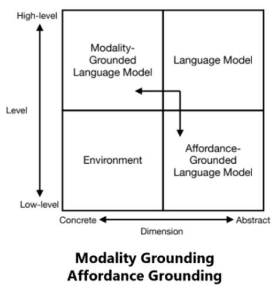

# [后ChatGPT技术链](https://www.toutiao.com/article/7241097147079311911/?app=news_article&timestamp=1686008761&use_new_style=1&req_id=20230606074600F93F170533DA3A81AD99&group_id=7241097147079311911&tt_from=weixin&utm_source=weixin&utm_medium=toutiao_ios&utm_campaign=client_share&wxshare_count=2&source=m_redirect)

## 交互
### ChatGPT后NLP论文

1. Tool Learning with Foundation Models 阐述了让语言模型使用工具进行推理或者执行现实操作 [2]；
2. Foundation Models for Decision Making: Problems, Methods, and Opportunities 阐述了如何使用语言模型执行决策任务 (decision making)[3]
3. ChatGPT for Robotics: Design Principles and Model Abilities 阐述了如何使用 ChatGPT 赋能机器人 [4]
4. Augmented Language Models: a Survey 阐述了如何使用思维链 (Chain of Thought)、工具使用（Tool-use）等增强语言模型，并指出了语言模型使用工具可以给外部世界产生实际的影响（即 act）[5]；
5. Sparks of Artificial General Intelligence: Early experiments with GPT-4 阐述了如何使用 GPT-4 执行各种类型的任务，其中包括了与人、环境、工具等交互的案例 [6]。
   
### 分类
$$ 交互\left\{
\begin{matrix}
 人\\
 知识库\\
 模型或工具\\
 环境 
\end{matrix}
\right.
$$

1. 与人交互：核心问题是alignment，使模型响应更加符合用户的需要
   - prompts提示：实时性、持续性，Conversation AI
   - feedback反馈：InstructGPT的RLHF
   - configuration配置：允许用户直接调节模型的超参数、级联方式，AI Chains
   - simulation模拟：RLHF的reward model、ITG的oracle model
   - Evaluating Human-Language Model Interaction
2. 与知识库交互：减轻语言模型的幻觉现象，提高输出的事实性、准确性、实效性
   - 确定补充知识的来源：Knowledge Source
     - 封闭的预料知识Corpus Knowledge：WiKiText
     - 开放的网络知识Internet Knowledge：搜索引擎
   - 检索知识：Knowledge Retrieval
     - Sparse Retrieval：n-gram匹配，BM25
     - Dense Retrieval：使用单塔模型或双塔模型作为检索器
     - Generative Retrieval：Differentiable Search Index
     - Reinforcement Learning：WebGPT
   - 使用知识进行增强：Interaction Message Fusion
3. 与模型或工具交互：分解复杂任务
   - Thinking：与自己本身交互，进行任务分解及推理，Multi-Stage Chain-of-Thought，ReAct，Least-to-Most Prompting，Self-Ask；
   - Acting：调用其他模型或外部工具，ReAct， HuggingGPT，Toolformer；
   - Collaborating：多个模型协作
     - Closed-Loop Interaction闭环交互：Socratic Models；
     - Theory of Mind心智理论：让一个智能体理解并预测另一个智能体的状态，Outstanding Paper, MindCraft ；
     - Communicative Agents沟通式代理：让多个智能体能够进行彼此交流协作，Generative Agents，DeepGCN 作者的新工作 CAMEL；
4. 与环境交互
   
   - Modality Grounding：让语言模型可以处理图像、音频等多模态信息；视觉-语言模型，单塔模型如 OFA，双塔模型如 BridgeTower，语言模型与视觉模型的交互如 BLIP-2；
   - Affordance Grounding:让语言模型在环境具体场景的尺度下对可能的、恰当的对象执行可能的、恰当的动作；SayCan，Grounded Decoding；
     - 场景尺度感知（scene-scale perception）
     - 可能的动作（possible action）

### 用什么交互：交互接口

1. 自然语言：如 few-shot example, task instruction, role assignment 甚至结构化的自然语言等。主要讨论了其在泛化性、表达性上的特点及作用等。
2. 形式语言：如代码、语法、数学公式等。主要讨论了其在可解析性、推理能力上的特点及作用等。
3. 机器语言：如 soft prompts, 离散化的视觉 token 等。主要讨论了其在泛化性、信息瓶颈理论、交互效率上的特点及作用等。
4. 编辑：主要包括了对文本进行的删除、插入、替换、保留等操作。讨论了它的原理、历史、优势以及目前存在的局限。
5. 共享记忆：主要包括了 hard memory 和 soft memory. 前者将历史状态记录在一个 log 里面作为记忆，后者使用一个可读可写的记忆外置模块保存张量。论文讨论了两者的特点、作用以及存在的局限等。

### 怎么交互：交互方法

1. Prompting: 不调整模型参数，仅仅通过 prompt engineering 的方式调用语言模型，涵盖了上下文学习（In-Context Learning）、思维链提示 (Chain of Thought)、工具使用提示 (Tool-use)、级联推理链 (Prompt Chaining) 等多种方法，详细讨论了各种 Prompting 技巧的原理、作用、各种 trick 和局限等，比如在可控性和鲁棒性上的考虑等。
2. Fine-Tuning: 进行模型参数的调整，以让模型从交互信息中进行学习更新。本节涵盖了监督指令精调 (Supervised Instruction Tuning)、参数高效精调 (Parameter-Efficient Fine-Tuning)、持续学习 (Continual Learning)、半监督学习 (Semi-Supervised Fine-Tuning) 等方法。详细讨论了这些方法的原理、作用、优势、在具体使用时的考虑、及其局限。其中还包括了部分 Knowledge Editing 的内容（即编辑模型内部的知识）。
3. Active Learning: 交互式的主动学习算法框架。
4. Reinforcement Learning: 交互式的强化学习算法框架，讨论了在线强化学习框架、离线强化学习框架、从人类反馈中学习（RLHF）、从环境反馈中学习（RLEF）、从 AI 反馈中学习 (RLAIF) 等多种方法。
5. Imitation Learning: 交互式的模仿学习算法框架，讨论了在线模仿学习、离线模仿学习等。
6. Interaction Message Fusion: 为上述所有交互方法提供了一个统一的框架，同时在这个框架中，向外扩展，讨论了不同的知识、信息融合方案，比如跨注意力融合方案 (cross-attention)、约束解码融合方案 (constrained decoding) 等。
