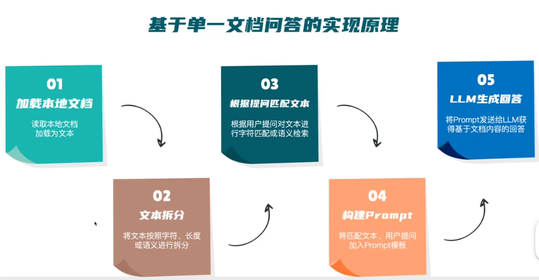

# ChatGLM + LangChain 实践培训

本地文档加载为文本，可以加载音视频吗？

字符匹配：精确匹配、模糊匹配
语义检索：向量空间里相似的意思，更常用到，能够跨语种

流式输出：一边生成，一边输出结果，不需要等待所有结果生成完毕

### 最佳拍档
语义搜索中出现的问题
1. 重复信息
   - 通过语义搜索过滤掉类似的文档
   - 利用最大边际相关算法来优化多样性
   - 在存储之前对文档进行去重
2. 冲突信息
   - 对来源进行优先级排序
   - 将所有源信息都传入生成的步骤，交由大模型来判断哪个信息源更可靠
3. 时效性
   - 在检索中对最近的信息进行加权
   - 给生成的信息带上时间戳
   - 不断反思，修订大语言模型对某一个话题的理解
4. 元数据查询
   - 加入元数据过滤器
5. 多跳问题
   - GPTCache
6. 写出好的prompt
