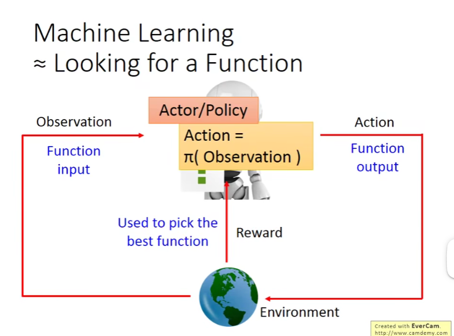

supervised：learning from teacher
reinforcement learning：learning from experience

episode：learn to maximize the experienced cumulative reward per episode

RL难点：
1. reward delay
   - 空间躲避，只有最后再能获得奖励，但中间的每一步都很重要
   - 下围棋，短暂的牺牲可能会获得长远的reward
2. agent的行为会影响后续看到的东西
   - 探索

RL分类：
1. policy-based：learning an actor
   
2. value-based：learning a critic

Asynchronous Advantage Actor-Critic(A3C)

maxmize expected value of Rθ

