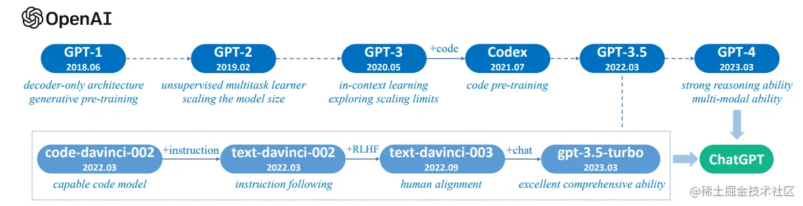

# [LLM学习记录](https://zhuanlan.zhihu.com/p/624918286)

[temperature](https://cloud.tencent.com/developer/article/2277750): 控制生成结果的多样性和随机性，通常用于“softmax”概率分布算法中。如果将温度参数设置为较高的值，那么softmax函数的输出结果将更加平滑，这将使生成结果更加多样化。相反，如果将温度参数设置为较低的值，softmax函数的输出结果将更加尖锐，这将使生成结果更加确定性。

